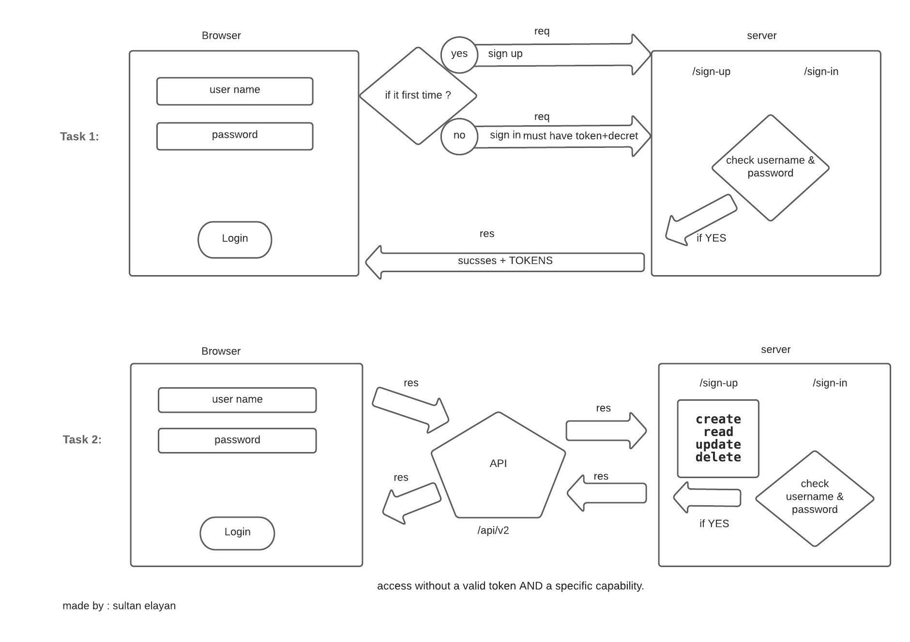

# auth-api

## NOTES

1. we learn about ACL
2. how server interact with browser

## Provided Link

- repo action -->> [repo action](https://github.com/sultan-elayan/auth-api/actions)
- PR -->> [PR](https://github.com/sultan-elayan/auth-api/pull/1)
- heroku -->> [heroku deployment](https://sultan-auth-api.herokuapp.com/) 

## MUL

